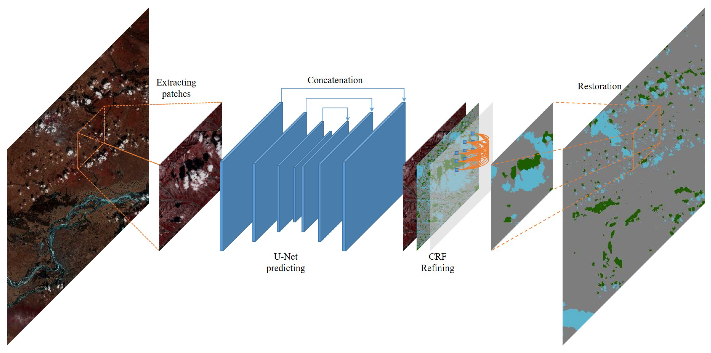

# <p style="text-align:center"> Tensorflow implementation of deep learning framework</p> <br> <p style="text-align:center"> Unet</p>
<div id="top"></div>
<br />
<div align="center">
  <a href="https://github.com/GuillaumeBarree/image_segmentation">
    
  </a>

  <h3 align="center">Deep Learning Engineer Challenge</h3>

  <p align="center">
    This repository has been designed to implement a generic U-Net architecture with Tensorflow 2.
    <br />
    <a href="https://github.com/GuillaumeBarree/image_segmentation"><strong>Explore the docs »</strong></a>
  </p>
</div>

<!-- TABLE OF CONTENTS -->
<details>
  <summary>Table of Contents</summary>
  <ol>
    <li>
      <a href="#about-the-project">About The Project</a>
      <ul>
        <li><a href="#built-with">Built With</a></li>
      </ul>
    </li>
    <li>
      <a href="#getting-started">Getting Started</a>
      <ul>
        <li><a href="#navigate-into-the-project">Navigate into the project</a></li>
        <li><a href="#prerequisites">Prerequisites</a></li>
        <li><a href="#installation">Installation</a></li>
      </ul>
    </li>
    <li><a href="#usage">Usage</a></li>
    <li><a href="#license">License</a></li>
    <li><a href="#contact">Contact</a></li>
  </ol>
</details>

<!-- ABOUT THE PROJECT -->
## About The Project

The objective of this project is to improve the U-Net implementation proposed by zhixuhao [here]("https://github.com/zhixuhao/unet")

The original mission was to :

* Having two different modes: train mode and predict mode
  * In training mode, the output is a (several) hdf5 model(s),
  * In predict mode, the outputs are the prediction maps (one map by label). The size of the prediction map is the same as the input image.

* Add some configurations to the model
  * For a training, either can start from existing weights or from scratch.
  * the number of pooling operations is defined by the user,
  * the number of layers before each pooling is defined by the user,
  * ability to choose the type of block :
    * standard block: input -> convolution (conv) -> batch normalization (BN) (optional) -> activation -> output
    * ResNet block: input -> conv -> BN -> activation -> conv -> BN -> activation -> tmp_output -> Add(input, tmp_output) -> output
    * OPTIONAL: find a new block and integrate it
  * padding can be same or valid in train
  * OPTIONAL: padding can be valid in predict
* Having a good code design, following standards, etc
* OPTIONAL: propose optimization ideas

<p align="right">(<a href="#top">back to top</a>)</p>

### Built With

This project has been developed in python using standard deep learning project libraries such as Tensorflow or opencv.

* [Python](https://www.python.org/)
* [Tensorflow](https://www.tensorflow.org/?hl=fr)
* [Hydra](https://hydra.cc/)

For more details on the modules and libraries used, please refer to the [requirement.txt](https://github.com/GuillaumeBarree/image_segmentation/blob/master/requirements.txt) file.

<p align="right">(<a href="#top">back to top</a>)</p>

<!-- GETTING STARTED -->
## Getting Started

### Navigate into the project

```bash
.
├── conf
├── data
│   └── membrane
│       ├── test
│       └── train
│           ├── image
│           └── label
├── models
├── notebook
├── scripts
├── src
│   └── image_segmentation
│       ├── common
│       ├── data
│       ├── main.py
│       └── models
├── tensorboard
└── test
```

* `./data`: Contains all data files.
* `./models`: Contains all trained models. This is the output directory.
* `./notebook`: Contains all the notebooks to speed up development and test new things.
* `./src`: Contains the image segmentation module.

<p align="right">(<a href="#top">back to top</a>)</p>

### Prerequisites

You will need Python 3.8 and pip on your computer and (the package installer for Python) or Docker to use the package inside a container.

### Installation
#### Directly on your laptop

1. Clone the repo

   ```sh
   git clone git@github.com:GuillaumeBarree/image_segmentation.git
   ```

2. Prepare your virtual environment

   ```sh
   cd image_segmentation
   source scripts/prepare_working_env.sh
   ```

   This will automatically:
   * export the environement variables;
   * create a virtual environement for the projet in `$UNXAPPLI/.venv`;
   * install all the need requirements.

#### Using Docker

1. Clone the repo

   ```sh
   git clone git@github.com:GuillaumeBarree/image_segmentation.git
   ```

2. Build the docker image

   This will build the docker image and save it in you local Docker Images. If you don't want to build the image and directly download the image build by GitHub Actions, go to step 3

   ```sh
   cd image_segmentation
   docker build -t img_seg:v0.0.1 -f docker/Dockerfile.image_segmentation .
   ```

3. Run the container

  If you want to use the image build by GitHub action, change the image name by [add image name]

  ```sh
   cd image_segmentation
   docker run -it -v "$(pwd)"/models:/image_segmentation/models -v "$(pwd)"/tensorboard:/image_segmentation/tensorboard v "$(pwd)"/conf:/image_segmentation/conf img_seg:v0.0.1
   ```

Now you can to the next section to excute the different command to train or predict. Models, Tensorflow and Conf folder have been mount so that you can change conf directly within your working station.

<p align="right">(<a href="#top">back to top</a>)</p>

<!-- USAGE EXAMPLES -->
## Usage

**All this project is configurable using configuration files. Their are available in the `conf` folder. For more details about these configuration files, please refer to our specific documentation [[here]](https://github.com/GuillaumeBarree/image_segmentation)**

### Launch the training from scratch

```bash
python3 src/image_segmentation/main.py nn.module.info.mode=training
```

#### Scratch training artefacts

The path to the training artefacts is displayed to the console at the end of the training.

* The configuration file used to build and train the model is saved.
* Weights of the best model are saved.

### Launch the training from existing weights

```bash
python3 src/image_segmentation/main.py nn.module.info.load_weights=path_to_weights nn.module.info.mode=training
```

Were path_to_weights is the absolute path to your model's weights.

#### Warm up training artefacts

The path to the training artefacts is displayed to the console at the end of the training.

* The weights used to initialize the model are saved
* The configuration file used to build and train the the existing model is saved.
* Weights of the best model are saved.

### Launch inference on test images

```bash
python3 src/image_segmentation/main.py nn.module.info.load_weights=path_to_weights nn.module.info.mode=predict
```

Were path_to_weights is the absolute path to your model.

#### Testing artefacts

The path to the testing artefacts is displayed to the console at the end of the prediction.

* The model used to predict is saved.
* The configuration file of the model is saved.
* Original images and their predictions are saved.

### Tensorboard

Tensorboad files are saved in the `./tensorboard` folder.

* On you local machine.

  ```bash
  tensorboard --logdir path_to_you_artefact
  ```

* On Docker

  ```bash
  tensorboard --logdir path_to_you_artefact --bind_all
  ```

  On your local machine, you can access it from `localhost:6006`

### Generate the documentation

```bash
cd ./docs
sphinx-apidoc -o ./source ../src
make html

cd ./build/html
firefox index.html
```

<p align="right">(<a href="#top">back to top</a>)</p>

<!-- LICENSE -->
## License

Distributed under the MIT License. See `LICENSE` for more information.

<p align="right">(<a href="#top">back to top</a>)</p>

<!-- CONTACT -->
## Contact

Barrée Guillaume - guillaume.barree@student-cs.fr
<p align="right">(<a href="#top">back to top</a>)</p>
